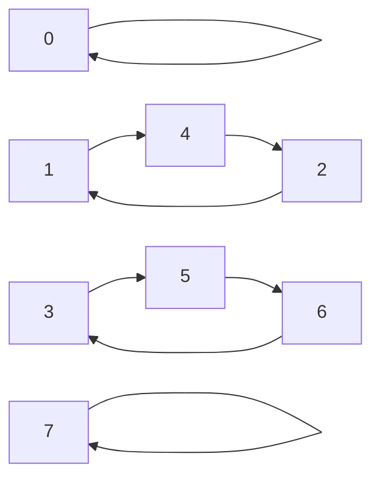

#### [1806. 还原排列的最少操作步数](https://leetcode.cn/problems/minimum-number-of-operations-to-reinitialize-a-permutation/)

给你一个偶数 `n` ，已知存在一个长度为 `n` 的排列 `perm` ，其中 `perm[i] == i`（下标 **从 0 开始** 计数）。

一步操作中，你将创建一个新数组 `arr` ，对于每个 `i` ：

- 如果 `i % 2 == 0` ，那么 `arr[i] = perm[i / 2]`
- 如果 `i % 2 == 1` ，那么 `arr[i] = perm[n / 2 + (i - 1) / 2]`

然后将 `arr` 赋值给 `perm` 。

要想使 `perm` 回到排列初始值，至少需要执行多少步操作？返回最小的 **非零** 操作步数。

##### 思路：

首先将问题想成一个数组中的数字的交换。



问题转化为找最大的交换环。可以猜想数字1和数字n-2一定在最大的环里。于是只需要模拟数字1就可以了。

##### Code

```C++
class Solution {
public:
    int reinitializePermutation(int n) { 
        int i = 1, step = 1;
        while (true) {
            i = i % 2 ? (n - 1 + i) / 2 : i / 2; //求1所在环长度
            if (i == 1) return step;
            step++;
        } 
    }
};
```

